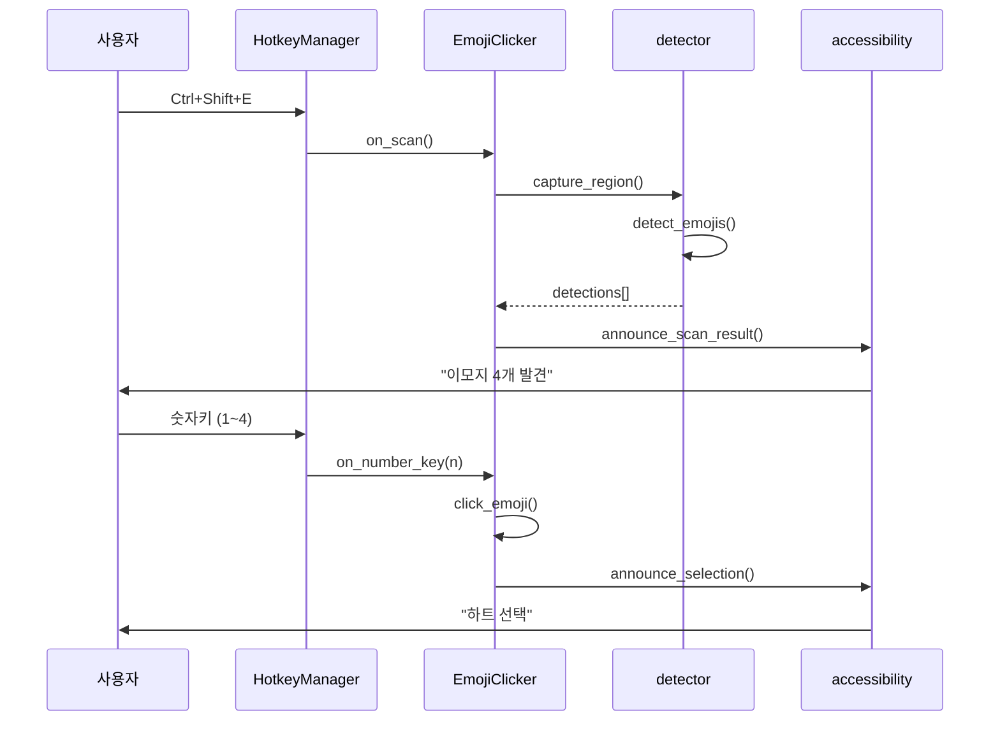
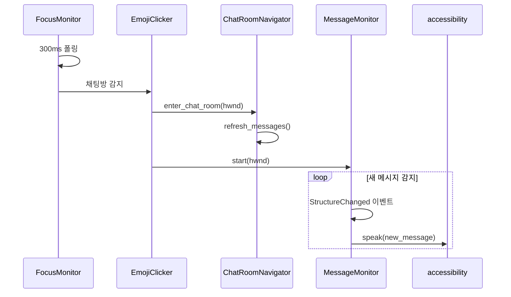
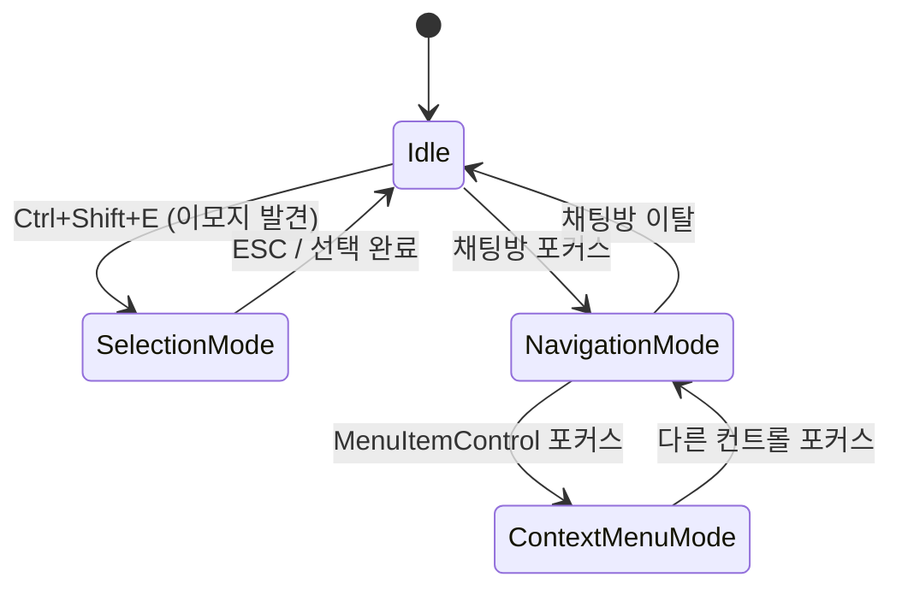

# 카카오톡 접근성 클라이언트 아키텍처

## 1. 개요

NVDA 등 스크린 리더 사용자를 위한 카카오톡 접근성 향상 도구입니다.
키보드만으로 카카오톡의 주요 기능을 조작할 수 있도록 합니다.

### 핵심 기능

1. **이모지 클릭**: 화면의 이모지를 탐지하고 키보드로 선택합니다.
2. **메시지 탐색**: 채팅방 메시지를 자동으로 읽어주고 포커스를 추적합니다.
3. **점자 디스플레이**: 음성 출력과 함께 점자 디스플레이에도 텍스트를 전송합니다.

### 대상 사용자

- 스크린 리더(NVDA, JAWS) 사용자
- 키보드 중심 사용자

---

## 2. 시스템 구조

### 계층도

```
┌─────────────────────────────────────────────────────────┐
│                    main.py (EmojiClicker)               │
│                       [조율 계층]                        │
└─────────────────────────────────────────────────────────┘
        │              │              │              │
        ▼              ▼              ▼              ▼
┌──────────────┐ ┌──────────────┐ ┌──────────────┐ ┌──────────────┐
│   입력 계층   │ │  탐색 계층   │ │  출력 계층   │ │  유틸 계층   │
├──────────────┤ ├──────────────┤ ├──────────────┤ ├──────────────┤
│ hotkeys.py   │ │ chat_room.py │ │accessibility │ │ uia_utils.py │
│              │ │msg_monitor   │ │   .py        │ │ debug.py     │
│              │ │              │ │              │ │ profiler.py  │
└──────────────┘ └──────────────┘ └──────────────┘ └──────────────┘
        │              │              │              │
        ▼              ▼              ▼              ▼
┌─────────────────────────────────────────────────────────┐
│                    외부 시스템                           │
│  Windows API │ UIA │ 스크린 리더 │ OpenCV               │
└─────────────────────────────────────────────────────────┘
```

### 모듈 구조

```
src/kakaotalk_a11y_client/
├── main.py                 # 진입점, 전체 조율
├── focus_monitor.py        # 포커스 모니터링 서비스 (이벤트 기반)
├── mode_manager.py         # 모드 전환 관리 (Navigation/Menu)
├── hotkeys.py              # RegisterHotKey 기반 전역 핫키
├── mouse_hook.py           # 마우스 훅 (비메시지 항목 우클릭 차단)
├── accessibility.py        # 음성 출력 추상화
├── window_finder.py        # 카카오톡 창 탐색
├── detector.py             # 이모지 탐지 (OpenCV)
├── clicker.py              # 마우스 클릭
├── config.py               # 설정값 (타이밍, 캐시, 성능 상수)
├── settings.py             # 설정 저장/로드 (JSON 기반)
├── gui/                    # wxPython GUI (시스템 트레이)
│   ├── __init__.py         # 패키지 초기화
│   ├── app.py              # KakaoA11yApp (wx.App)
│   ├── main_frame.py       # 숨겨진 메인 프레임
│   ├── tray_icon.py        # 시스템 트레이 아이콘
│   ├── settings_dialog.py  # 설정 다이얼로그 (탭 기반)
│   ├── status_panel.py     # 상태 표시 패널
│   ├── hotkey_panel.py     # 핫키 설정 패널 (+ re-export)
│   ├── hotkey_dialog.py    # 핫키 변경 다이얼로그
│   └── debug_hotkey_panel.py # 디버그 단축키 설정 패널
├── infrastructure/         # 인프라 어댑터 (UIA/음성 추상화)
│   ├── uia_adapter.py      # UIA 직접 호출 래핑
│   └── speak_callback.py   # 음성 출력 콜백 팩토리
├── navigation/
│   ├── chat_room.py        # 채팅방 메시지 탐색
│   └── message_monitor.py  # 새 메시지 자동 읽기
└── utils/
    ├── uia_utils.py        # UIA 탐색 유틸리티 (+ re-export)
    ├── uia_reliability.py  # UIA 신뢰도 판단 (클래스별 UIA/MSAA 선택)
    ├── uia_exceptions.py   # COMError 안전 래퍼 (safe_uia_call)
    ├── uia_tree_dump.py    # UIA 트리 덤프/비교 유틸리티
    ├── uia_cache.py        # UIA 캐싱
    ├── uia_events.py       # UIA COM 초기화 (+ re-export)
    ├── uia_focus_handler.py # FocusChanged 이벤트 모니터
    ├── uia_message_monitor.py # StructureChanged 메시지 모니터
    ├── uia_cache_request.py # UIA CacheRequest 관리
    ├── uia_workarounds.py  # 카카오톡 UIA 우회
    ├── beep.py             # 테스트/디버그용 비프음
    ├── debug.py            # 로깅
    ├── debug_config.py     # 디버그 설정 관리
    ├── debug_tools.py      # 디버그 도구 (덤프, 리포트)
    ├── debug_commands.py   # 디버그 단축키 등록
    ├── profiler.py         # 성능 측정
    ├── process_lock.py     # 프로세스 중복 실행 방지
    ├── com_utils.py        # COM 초기화 헬퍼
    └── event_monitor/      # 디버그용 이벤트 모니터링 시스템
        ├── types.py        # EventType, EventLog, OutputFormat
        ├── config.py       # EventMonitorConfig
        ├── monitor.py      # EventMonitor 통합 클래스
        ├── recommender.py  # ControlType별 권장 이벤트
        ├── handlers/       # 이벤트 핸들러 (Focus, Structure, Property)
        └── formatters/     # 출력 포맷터 (Console, JSON, Table)
```

### 파일별 책임

| 파일 | 책임 | 라인 수 |
|------|------|--------|
| main.py | 전체 플로우 조율, 컴포넌트 생명주기 | ~400 |
| focus_monitor.py | 포커스 모니터링 서비스 (FocusChanged 이벤트) | ~420 |
| mode_manager.py | 모드 전환 관리 (Navigation/ContextMenu) | ~150 |
| hotkeys.py | 전역 핫키 등록/해제 (RegisterHotKey API) | ~265 |
| config.py | 타이밍/캐시/성능 상수 관리 | ~80 |
| accessibility.py | 스크린 리더/TTS 통합 인터페이스 | ~85 |
| window_finder.py | 카카오톡 창 탐색 및 검증 | ~400 |
| chat_room.py | 채팅방 메시지 UIA 탐색 | ~145 |
| message_monitor.py | 새 메시지 이벤트 기반 자동 읽기 | ~270 |
| **gui/** | | |
| hotkey_panel.py | 핫키 설정 패널 (+ re-export) | ~245 |
| hotkey_dialog.py | 핫키 변경 다이얼로그 | ~185 |
| debug_hotkey_panel.py | 디버그 단축키 설정 패널 | ~240 |
| **infrastructure/** | | |
| uia_adapter.py | UIA 직접 호출 래핑 (의존성 역전) | ~205 |
| speak_callback.py | 음성 출력 콜백 팩토리 | ~35 |
| **utils/** | | |
| uia_utils.py | UIA 탐색 유틸리티 (+ re-export) | ~316 |
| uia_reliability.py | UIA 신뢰도 판단 (클래스별 선택) | ~70 |
| uia_exceptions.py | COMError 안전 래퍼 | ~75 |
| uia_tree_dump.py | UIA 트리 덤프/비교 | ~326 |
| uia_cache.py | UIA 캐싱 (메시지, 메뉴, 창) | ~215 |
| uia_events.py | UIA COM 초기화 (+ re-export) | ~134 |
| uia_focus_handler.py | FocusChanged 이벤트 모니터 | ~254 |
| uia_message_monitor.py | StructureChanged 메시지 모니터 | ~350 |
| uia_workarounds.py | 카카오톡 특수 UIA 우회 | ~190 |

### 아키텍처 평가 지표

**계층 구조 (4계층)**

```
┌─────────────────────────────────────────────┐
│           GUI (wxPython)                     │
│  gui/app.py → gui/main_frame.py             │
└──────────────────┬──────────────────────────┘
                   ↓
┌──────────────────┴──────────────────────────┐
│      Application (EmojiClicker)              │
│  main.py                                     │
└──────────────────┬──────────────────────────┘
                   ↓
┌──────────────────┴──────────────────────────┐
│           Domain                             │
│  navigation/ │ detector.py │ hotkeys.py     │
│  clicker.py  │ mouse_hook.py │ settings.py  │
└──────────────────┬──────────────────────────┘
                   ↓
┌──────────────────┴──────────────────────────┐
│        Infrastructure                        │
│  infrastructure/ │ utils/uia_*.py           │
│  utils/debug.py │ window_finder.py          │
│  accessibility.py                            │
└─────────────────────────────────────────────┘
```

**모듈별 아키텍처 준수율** (2026-01 분석 기준)

| 모듈 | 준수율 | 비고 |
|------|--------|------|
| utils/uia_cache.py | 92% | 모범 사례 (NVDA 패턴) |
| utils/uia_utils.py | 89% | 모범 사례 (safe_uia_call) |
| accessibility.py | 88% | 양호 |
| settings.py | 86% | 양호 |
| navigation/chat_room.py | 81% | 양호 |
| hotkeys.py | 78% | 양호 |
| utils/uia_events.py | 75% | 개선 필요 |
| window_finder.py | 72% | 개선 필요 |
| main.py | 64% | 우선 개선 대상 (책임 과다) |

**의존성 방향**
- 단방향 하향식 (GUI → Application → Domain → Infrastructure)
- 순환 의존성 없음
- 역방향 통신은 콜백/이벤트 패턴 사용

**개발 가이드라인**: [ARCHITECTURE_RULES.md](../.claude/guides/ARCHITECTURE_RULES.md)

---

## 3. 핵심 컴포넌트

### 3.1 EmojiClicker (main.py)

전체 시스템을 조율하는 중심 클래스입니다.

```python
class EmojiClicker:
    # 컴포넌트 인스턴스
    hotkey_manager: HotkeyManager
    chat_navigator: ChatRoomNavigator
    message_monitor: MessageMonitor

    # 상태 플래그
    _in_selection_mode: bool      # 이모지 선택 모드
    _in_navigation_mode: bool     # 메시지 탐색 모드
    _in_context_menu_mode: bool   # 컨텍스트 메뉴 모드 (포커스 추적용)
    _current_chat_hwnd: int       # 현재 채팅방 핸들
```

다음과 같은 역할을 담당합니다:

- 모든 컴포넌트의 초기화 및 생명주기 관리
- 핫키 이벤트를 적절한 핸들러로 라우팅
- 모드 전환 및 상태 관리
- 포커스 모니터링 (채팅방 진입/이탈, 메뉴 항목 감지)

### 3.2 HotkeyManager (hotkeys.py)

Windows RegisterHotKey API를 사용하는 전역 핫키 관리자입니다.

```python
class HotkeyManager:
    # 항상 활성 핫키 (설정 파일에서 커스터마이징 가능)
    Ctrl+Shift+E  → on_scan (이모지 스캔)
    Win+Ctrl+K    → 프로그램 종료

    # 선택 모드에서만 활성
    ESC           → on_cancel
    1~4           → on_number_key
```

RegisterHotKey API를 사용하기 때문에 NVDA 같은 스크린 리더와 충돌 없이 동작합니다.

### 3.3 MouseHook (mouse_hook.py)

WH_MOUSE_LL 훅을 사용해 비메시지 항목에서 우클릭을 차단합니다.

**차단 대상:**
- 날짜 구분자 (`2026년 1월 2일 금요일`)
- 읽지 않음 구분선 (`읽지 않은 메시지`)
- 입퇴장 알림 (`님이 들어왔습니다`, `님이 나갔습니다`)

**설계 결정:**

메뉴가 열린 후 ESC로 닫는 방식은 메뉴가 열렸다 닫히는 UX 문제가 있습니다. WH_MOUSE_LL 훅으로 우클릭 자체를 차단하면 팝업메뉴가 아예 열리지 않아 더 자연스럽습니다.

```python
class MouseHook:
    # 비메시지 패턴 (팝업메뉴 차단 대상)
    NON_MESSAGE_PATTERNS = ["년 ", "읽지 않은 메시지", ...]

    def _mouse_callback(self, nCode, wParam, lParam):
        if wParam == WM_RBUTTONDOWN:
            if self._is_non_message_item(last_focused_name):
                return 1  # 이벤트 차단
        return CallNextHookEx(...)
```

주의: 마우스 훅은 시스템 전체에 영향을 주므로, 현재 포커스된 항목(`_last_focused_name`)이 비메시지 패턴일 때만 차단합니다.

### 3.4 ChatRoomNavigator (navigation/chat_room.py)

채팅방 메시지를 UIA로 탐색하는 클래스입니다.

```python
class ChatRoomNavigator:
    messages: list[Control]       # 메시지 컨트롤 배열
    chat_control: Optional[Control]  # 채팅방 컨트롤
    list_control: Optional[Control]  # 메시지 목록 컨트롤
    is_active: bool               # 활성화 여부
```

주요 메서드:

- `enter_chat_room(hwnd)`: 채팅방 진입, 메시지 목록 캐싱
- `exit_chat_room()`: 채팅방 이탈, 리소스 정리
- `refresh_messages()`: 메시지 목록 새로고침

### 3.5 FocusMonitorService (focus_monitor.py)

포커스 변경을 감지하고 적절한 항목을 읽어주는 서비스입니다.

```python
class FocusMonitorService:
    _mode_manager: ModeManager
    _message_monitor: MessageMonitor
    _chat_navigator: ChatRoomNavigator
    _focus_monitor: FocusMonitor  # UIA FocusChanged 이벤트 처리
```

주요 기능:

- **FocusChanged 이벤트 기반**: UIA `AddFocusChangedEventHandler()` 사용
- **ListItem/TabItem 읽기**: 목록 항목, 탭 항목 포커스 시 자동 읽기
- **메뉴 모드 관리**: EVA_Menu 창 감지 시 컨텍스트 메뉴 모드 진입
- **채팅방 자동 진입**: 채팅방 창 감지 시 네비게이션 모드 진입

### 3.6 MessageMonitor (navigation/message_monitor.py)

새 메시지를 자동으로 읽어주는 클래스입니다.

```python
class MessageMonitor:
    _running: bool            # 실행 상태
    _list_monitor: MessageListMonitor  # 이벤트 모니터
```

UIA StructureChanged 이벤트를 기반으로 동작합니다:

- 메시지 변화를 실시간으로 감지합니다.
- 새 메시지만 선별하여 음성으로 출력합니다.
- 시스템 메시지는 자동으로 필터링합니다.

**MessageListMonitor (uia_events.py)**:

- StructureChanged 이벤트를 감시합니다.
- 메시지 목록 컨트롤에 특화되어 있습니다.
- 이벤트 수신 시 콜백을 호출합니다.

---

## 4. 데이터 흐름

### 4.1 이모지 스캔 → 선택



#### 이모지 인식 동작 원리

**좌표 시스템: 상대 좌표 기반**

1. `find_chat_window()` → 카카오톡 창 핸들 획득
2. `get_window_rect(hwnd)` → 창의 화면 좌표 (left, top, right, bottom)
3. `capture_region(rect)` → 해당 영역만 캡처
4. `detect_emojis(image)` → 캡처 이미지 내에서 템플릿 매칭, **상대 좌표** 반환
5. `click_emoji()` → 상대 좌표 + 창 오프셋 = 절대 좌표로 변환 후 클릭

```python
# clicker.py - 좌표 변환
screen_x = pos[0] + window_offset[0]  # 상대 → 절대
screen_y = pos[1] + window_offset[1]
```

**템플릿 매칭 (OpenCV)**

- `cv2.matchTemplate()` 사용 (TM_CCOEFF_NORMED)
- 임계값: 0.8 이상이면 매칭 성공
- NMS(Non-Maximum Suppression)로 중복 제거

**템플릿 이미지 위치**

- 패키지 내부: `src/kakaotalk_a11y_client/emojis/`
- 빌드 시 자동 포함됨

**한계점**

- 템플릿 이미지는 특정 해상도/DPI에서 크롭됨
- 다른 해상도/DPI에서는 이모지 크기가 달라 매칭 실패 가능
- 향후 멀티 스케일 매칭으로 개선 예정

### 4.2 채팅방 진입 → 메시지 모니터링



### 4.3 포커스 추적 (메뉴/목록 항목)

포커스 모니터가 메뉴 항목(`MenuItemControl`)이나 목록 항목(`ListItemControl`)의
포커스를 감지하면 자동으로 항목 이름을 읽어줍니다.
NVDA의 네이티브 동작과 함께 작동합니다.

---

## 5. 스레딩 모델

### 스레드 목록

| 스레드 | 역할 | 동작 방식 |
|--------|------|----------|
| Main | wx.App.MainLoop (GUI) 또는 wait_for_exit (콘솔) | - |
| HotkeyManager | Windows 메시지 루프 | 블로킹 |
| FocusMonitor | 포커스 모니터링 (폴링 + 이벤트) | 폴링: 메뉴/채팅방 감지, 이벤트: ListItem/TabItem |
| FocusChanged 이벤트 | UIA FocusChanged 핸들러 | 이벤트 기반 |
| MessageListMonitor | StructureChanged 이벤트 | 이벤트 기반 |
| Callback 스레드 | 핫키 콜백 | 즉시 |

### 실행 모드

| 모드 | 메인 루프 | 시작 옵션 |
|------|----------|----------|
| GUI (기본) | wx.App.MainLoop() | `uv run kakaotalk-a11y` |
| 콘솔 | wait_for_exit() | `uv run kakaotalk-a11y --console` |

### 스레드 생명주기

```
프로그램 시작
    │
    ├─ HotkeyManager.start()
    │     └─ 메시지 루프 스레드 시작
    │
    ├─ _start_focus_monitor()
    │     └─ 포커스 모니터 스레드 시작
    │
    └─ 채팅방 진입 시
          └─ MessageMonitor.start(hwnd)
                └─ 메시지 모니터 스레드 시작

프로그램 종료
    │
    ├─ MessageMonitor.stop()
    ├─ _stop_focus_monitor()
    └─ HotkeyManager.cleanup()
```

### COM 초기화 규칙

```python
# 각 스레드에서 UIA 사용 전 필수
pythoncom.CoInitialize()

# 데코레이터로 자동화
@ensure_com_initialized
def uia_operation():
    ...
```

---

## 6. 외부 의존성

### Windows API

| API | 용도 |
|-----|------|
| RegisterHotKey | 전역 핫키 등록 |
| GetForegroundWindow | 활성 창 확인 |
| EnumWindows | 창 열거 |
| GetClassName | 창 클래스명 확인 |
| GetWindowText | 창 제목 확인 |
| GetWindowRect | 창 좌표 확인 |

### 라이브러리

| 라이브러리 | 용도 |
|-----------|------|
| uiautomation | UIA 래퍼 |
| pyautogui | 화면 캡처, 마우스 클릭 |
| opencv-python-headless | 이모지 템플릿 매칭 |
| accessible_output2 | 스크린 리더 연동 |
| wxPython | 시스템 트레이 GUI |

### 스크린 리더 연동

```python
# 우선순위: NVDA/JAWS → 로컬 TTS
import accessible_output2.outputs.auto as ao
speaker = ao.Auto()
speaker.speak(text)
```

---

## 7. 상태 관리

### 모드 전이도



### 상태 플래그 규칙

| 플래그 | 활성화 조건 | 비활성화 조건 |
|--------|------------|--------------|
| `_in_selection_mode` | Ctrl+Shift+E + 이모지 발견 | ESC, 숫자키 선택 |
| `_in_navigation_mode` | 채팅방 창 포커스 | 포커스 이탈 |
| `_in_context_menu_mode` | MenuItemControl 포커스 감지 | 다른 컨트롤 포커스 |

### 상호 배제

- 선택 모드 진입 시 → 네비게이션 모드 종료
- 포커스 이탈 시 → 네비게이션 모드 종료 (메뉴 모드 제외)

---

## 8. 설계 결정

### ADR-001: 핫키 구현 방식

RegisterHotKey API를 사용합니다.

이렇게 결정한 이유:
- NVDA 등 스크린 리더와 충돌이 없습니다.
- 전역 수준에서 동작하여 안정적입니다.

트레이드오프:
- modifier 없는 단일 키 후킹은 불가능합니다 (방향키 등).
- 하지만 스크린 리더 호환성이 최우선입니다.

### ADR-002: 포커스 모니터링 방식

**하이브리드 방식**을 사용합니다: 이벤트 기반 + 폴링 보조.

**v0.4.0 변경사항:**
- 기존: 적응형 폴링 (250~300ms 간격) 전용
- 현재: FocusChanged 이벤트 기반 + 폴링 보조 (메뉴/채팅방 감지용)

**이벤트 기반 (ListItem/TabItem 읽기):**
- UIA `AddFocusChangedEventHandler()` 사용
- NVDA 패턴 적용: `compareElements`로 중복 필터링
- 비카카오톡 창 필터링 (hwnd 체크)

**폴링 보조 (메뉴/채팅방 감지):**
- EVA_Menu 창 감지 → 컨텍스트 메뉴 모드 진입
- 채팅방 창 감지 → 네비게이션 모드 진입
- 300ms 간격 (비활성 시 500ms)

이렇게 변경한 이유:
- 이벤트 기반이 더 빠른 응답 제공 (폴링 지연 없음)
- CPU 부하 감소 (폴링 빈도 감소)
- NVDA 검증된 패턴 적용으로 안정성 확보

트레이드오프:
- comtypes 의존성 필요
- COM 이벤트 핸들러 등록 필요

### ADR-003: 새 메시지 감지 방식

UIA StructureChanged 이벤트를 사용합니다.

이렇게 결정한 이유:
- UIA StructureChanged 이벤트가 안정적으로 동작합니다.
- 실시간 감지로 지연이 최소화됩니다 (~50ms).
- 폴링이 불필요하여 CPU 부하가 없습니다.

트레이드오프:
- COM 이벤트 핸들러 등록이 필요합니다.
- 카카오톡 UIA 구조 변경 시 대응이 필요합니다.

### ADR-004: MessageMonitor pause/resume 패턴

팝업메뉴 열림/닫힘 시 `stop()/start()` 대신 `pause()/resume()`을 사용합니다.

**문제 상황:**
팝업메뉴가 열리면 hwnd가 채팅방에서 메뉴 창(EVA_Menu)으로 변경됩니다.
이때 MessageMonitor를 중지했다가 메뉴 닫힘 후 재시작하면 다음 오버헤드가 발생합니다:

- `pythoncom.CoInitialize()` - 스레드별 COM 초기화
- `CreateObject(CUIAutomation)` - UIA 클라이언트 생성
- `AddStructureChangedEventHandler()` - 이벤트 핸들러 등록 (cross-process)
- `RemoveStructureChangedEventHandler()` - 이벤트 핸들러 해제

이 과정에서 500ms~1초의 CPU 스파이크가 발생할 수 있습니다.

**해결책:**
```python
# pause: 이벤트 수신은 유지, 콜백만 무시
def _on_structure_changed(self, change_type):
    if not self._running or self._paused:  # paused 체크 추가
        return
    # 이벤트 처리...
```

**장점:**
- COM 재등록 오버헤드 없음 (핸들러 유지)
- 이벤트 손실 없음 (메뉴 닫힘 후 즉시 처리 재개)
- 메뉴 감지 정확도와 무관하게 안정적으로 동작

**참고 자료:**
- [Microsoft UIA Caching](https://learn.microsoft.com/en-us/windows/win32/winauto/uiauto-cachingforclients): UIA cross-process 호출 비용
- [pywinauto UIA performance](https://github.com/pywinauto/pywinauto/issues/256): UIA 백엔드 성능 이슈

---

## 9. 향후 개선

### 완료됨

1. ~~**context_menu.py 단순화**~~ → 제거 완료 (NVDA 네이티브 동작에 위임)
2. ~~**메인 창 탐색**~~ → 구현 완료
   - 친구 목록, 채팅 목록 탐색 (포커스 모니터의 ListItemControl 처리, `main.py:285-295`)

### 단기 (성능)

1. **메뉴 감지 안정화** (우선순위: 높음)

   **현재 문제:**
   - EVA_Menu 창 감지가 불안정하여 pause/resume 반복 발생
   - 0.15초 폴링마다 있음/없음이 깜빡이는 현상

   **적용된 개선:**
   - 채팅방 진입 시 메뉴 모드 체크로 반복 진입 방지 ✓
   - 메뉴 종료 시 0.3초 grace period 적용 ✓
   - grace period 동안 `_last_focused_name` 리셋 방지 ✓

   **남은 문제:**
   - `find_kakaotalk_menu_window()` (EnumWindows 기반) 결과 불안정
   - 메뉴 내 탐색 시 같은 항목 반복 읽힘

   **후보 해결책 (미적용):**
   - 메뉴 감지 캐싱 (마지막 감지 결과 일정 시간 유지)
   - 항목 읽기 시간 기반 디바운싱 (같은 항목 0.5초 내 재읽기 방지)
   - grace period 연장 (0.3초 → 0.5초, 반응성 저하 우려)
   - pause/resume 제거 (메뉴 모드에서도 MessageMonitor 유지)

### 중기 (기능)

1. **더 많은 이모지 지원**
   - 템플릿 이미지 추가
   - 동적 로딩

### 장기 (확장)

1. **플러그인 시스템**
   - 기능 확장 인터페이스

2. **테스트 자동화**
   - UIA 모킹
   - 통합 테스트

---

## 부록: 디버깅 가이드

### 디버그 모드 실행

```powershell
# CLI 옵션 (권장)
uv run kakaotalk-a11y --debug              # DEBUG 레벨
uv run kakaotalk-a11y --debug --trace      # TRACE 레벨 (고빈도 로그 포함)
uv run kakaotalk-a11y --debug-profile      # 프로파일러만
uv run kakaotalk-a11y --debug --debug-events        # 이벤트 모니터 포함
uv run kakaotalk-a11y --debug --debug-dump-on-start # 시작 시 트리 덤프

# 환경변수 (레거시)
$env:DEBUG=1; uv run kakaotalk-a11y  # DEBUG 레벨
$env:DEBUG=2; uv run kakaotalk-a11y  # TRACE 레벨
```

### 로그 파일 위치

| 파일 | 설명 |
|------|------|
| `logs/debug.log` | 디버그 로그 (프로젝트 폴더) |
| `logs/profile_*.log` | 프로파일러 로그 |

### 로그 확인

```powershell
Get-Content C:\project\kakaotalk-a11y\client\logs\debug.log -Tail 50
```

### 디버그 단축키 (--debug 모드)

| 단축키 | 기능 |
|--------|------|
| Ctrl+Shift+D | UIA 트리 덤프 |
| Ctrl+Shift+P | 프로파일 요약 |
| Ctrl+Shift+R | 이벤트 모니터 토글 |
| Ctrl+Shift+S | 디버그 상태 확인 |
| Ctrl+Shift+1 | 탐색 테스트 |
| Ctrl+Shift+2 | 메시지 테스트 |

### 주요 로그 포인트

| 위치 | 내용 |
|------|------|
| `포커스 모니터` | 창 전환 감지 |
| `메시지 모니터` | 새 메시지 감지 |
| `핫키 매니저` | 핫키 이벤트 |
| `Speech` | 음성 발화 (text, interrupt 파라미터) |

### 자동 감지 시스템 (v0.5.1+)

문제 발생 시 자동으로 UIA 트리 덤프를 생성합니다. 수동 Ctrl+Shift+D 없이도 원인 분석 가능.

| 시나리오 | 트리거 조건 | 덤프 위치 |
|----------|------------|----------|
| `focus_speak_fail` | compareElements 오판, 빈 Name 감지 | `logs/` |
| `enter_fail` | 채팅방 진입 실패 | `logs/` |

**활성화**: `--debug` 모드에서 자동 동작

### 음성 발화 정책

- **기본 interrupt=False**: NVDA 자동 발화와 충돌 방지
- 스크린 리더가 이미 읽고 있는 내용을 끊지 않음
- 스크린 리더 미설치 시 WARNING 레벨로 fallback 로그 출력
